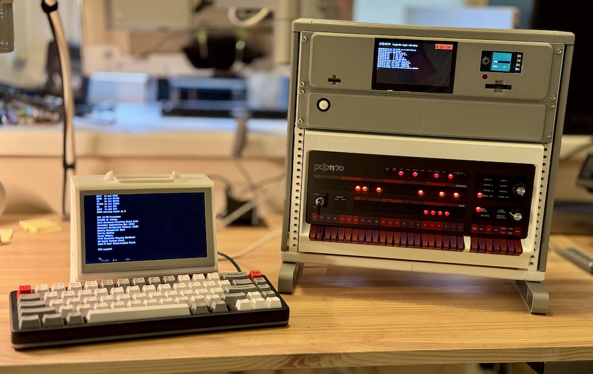

# pip11 Home for all pip-11 submodules

## What is this?

This is another attempt to get a working PDP-11 on the table and play the original TETRIS, this time using the bare metal hardware of a Raspberry : Pi and Pico.

## Why is this?

Yes, you can use SIMH, which requires a full operating system to work. PIP-11 allows almost the same thing but in a few seconds after powering on. It is much simpler and easier to make changes to.

## What do you get?

- PDP 11/70 KB11-C Processor
- 3840KB of system memory
- FP11 Hardware Floating Point Unit
- Extended Instruction Set (EIS)
- KT11 Memory Management Unit with 16, 18 and 22bit address space
- 60 Cycle System Clock
- KW11-P User Programmable Clock
- RK11 Drive controller with 8 RK02 5mb units
- RL11 Drive controller with 4 RL02 10mb units
- T11 DECtape controller with single 289K unit
- KL11 Serial console
- ODT (Octal Debugging Technique) via terminal when cpu is halted

Optional:

- LP11 Line Printer (output to file on SD card)
- PC11 Paper Tape punch and reader (input / output to SD card files)
- PDP-11/70 Panel support (Hardware from [PIDP-11, Obsolescence Guaranteed](https://obsolescence.wixsite.com/obsolescence/pidp-11 ))
- VT100 / VT52 serial terminal

## Hardware requirements

To assemble the <ins>main module</ins> you will need:

- Raspberry Pi 4 (preferred)  or 3
- It is advisable to use a cooling system - a radiator and a fan.
- Any suitable hdmi or dsi display. I'm using 5" DSI display from Waveshare
- SD card, a capacity of 4GB is quite enough
- Power supply. I'm using 5V 3A PSU to power both main and panel modules.
- Optional TTL-RS232 level converter.
- Serial cable or USB-Serial converter to connect a terminal.
- Network ethernet cable to connect a panel and for software updates.

Raspberry Pi 5 is not fully supported by used programming environment (circle, step 48).

<ins>Terminal module:</ins>

You can use any suitable device that can be connected via a serial port.
The hardware parameters used for connection are 115200 bit/s, No parity, 1 stop bit.
Hardware flow control is not supported.
The flow rate is limited programmatically on the main module side at 28800 bit/s to avoid possible problems with character loss and buffer overflow.
Good support for VT100 commands is required.

But the terminal module has additional capabilities, including useful keyboard shortcuts for control, support for the VT52 and 15ИЭ-00-013 commands, and the КОИ7Н1 code page (used by TETRIS).

For the terminal module you will need:

- Raspberry Pi 4 or 3
- It is advisable to use a cooling system - a radiator and a fan.
- Any suitable hdmi or dsi display. I'm using 7" DSI display from Waveshare
- USB Keyboard
- SD card (or USB flash) to boot from.
- Optional active low-level Buzzer for a bell sound
- Optional TTL-RS232 level converter.
- Serial cable to connect a main module.
- Network ethernet cable for software updates.
- Power supply (5V 1A).

Raspberry Pi 5 is not fully supported by used programming environment (circle, step 48th).

<ins>The console panel module:</ins>

Is heavily based on hardware components from the PIDP-11 project and is an alternative firmware for the Raspberry Pi.

- PIDP-11 panel
- Raspberry Pi 4 (preferred) or 3
- It is advisable to use a cooling system - a radiator and a fan.
- SD card (or USB flash) to boot from.
- Power supply.
- Network ethernet cable to connect a main module and for software updates.

Raspberry Pi 5 is not fully supported by used programming environment (circle, step 48th).

<ins>"Paper" module:</ins>

From the PDP point of view it is two standard UNIBUS devices - a line printer LP11 and a paper tape reader/puncher PC11, but is physically connected via the I²C bus. With the potential to connect additional devices to the same bus.

You will need:

- Raspberry Pi Pico 1 (RP2040)
- SD Card interface
- SPI LCD screen with buttons. I'm using Pico-LCD-1.3 from Waveshare

<ins>Rack / Cabinet</ins>

Is based on a [A modular 3d-printable mini rack system](https://github.com/jazwa/rackstack)

## Software requirements

Raspberry Pi 3, 4 modules are based on [Circle C++ bare metal programming environment for the Raspberry Pi](https://github.com/rsta2/circle), step 48th. Please refer to the circle documentation for details.

Raspberry Pico module is based on a [Pico C++ SDK](https://www.raspberrypi.com/documentation/microcontrollers/c_sdk.html). Please refer to the SDK documentation for details.

Pi and Pico are using the same ARM 32 bit toolchain, no additional installation required.

**SIMH**

Since the disk and tape image formats used are SIMH-compatible, you can use 
[simh - The Computer History Simulation Project](https://github.com/simh/simh) to create and edit images, generate a system, etc.

## Further reading

- [Building PIP-11](BUILD.md)
- [Connecting modules](PINOUT.md)
- [SD card files](SDCARD.md)
- [System boot or file exchange and firmware update](BOOT.md)
